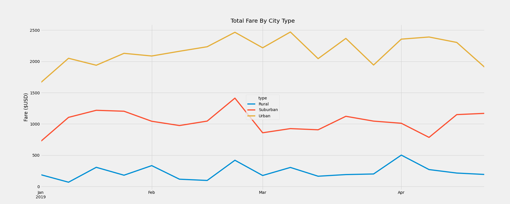
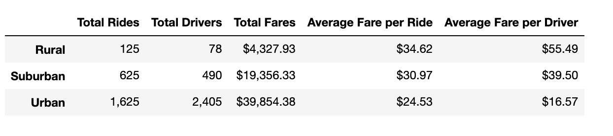

# PyBer Analysis

## Overview of the Analysis
The purpose of this analysis is to produce visualizations showing weekly fares by city type to the  PyBer CEO, V. Isualize. Decision-makers need to understand how their company is operating. For a ride-sharing company, it is important for them to know information about their drivers, fares, and rides. This information can be used to determine which cities/areas need increased driver support, when to implement pricing changes, areas to prioritize marketing resources, etc. In this analysis, we categorized the data into type of city because there are significant differences in number drivers, number of rides, and average fares depending on whether the city is urban, suburban, or rural. For this presentation, we analyzed PyBer's earnings by showing them the fares over the time period from January to April by city type. 
Performing the analysis was an exercise in using Python and its pandas library. The exercise exposed us to using matplotlib to create the required multi-line chart. When data is presented to stakeholders, visualizations are a fundamental tool to be able to easily communicate relationships and findings of the data. Creating dynamic, insightful, and easy-to-read visualizations is an important skill for data analysts. 

## Results

*Total Fares by City Type from January to April 28, 2019*

*PyBer summary DataFrame (2019)*

The PyBer summary DataFrame provides a broad overview of PyBer's ride-sharing data. It summarizes information about rides, fares, drivers, and respective averages by city type for the entire dataset provided. While it does contain more information than the chart visualization, it also requires more time to understand the information presented and draw conclusions. Alternatively, the multi-line chart only displays the total fares earned by each city type during a specific time period, specifically January 1 - April 28, 2019. However, the benefit of the multi-line chart is its ease of interpretation. Since the chart is easy to understand, the CEO and other executives can quickly make conclusions that will aid in making decisions to guide the business in the right direction because their decisions will be backed by data. 

The PyBer summary DataFrame shows that urban cities have more drivers, rides, and total fares compared to suburban and rural cities. The differences between city types is significant. There were 1,625 total rides given by 2,405 drivers with a total fare of $39,854.28 in 2019 in urban cities. Suburban cities saw 625 total rides given by 490 drivers for a total fare of $19,366.33. Comparatively, rural cities had the least amount in all three datapoints. However, the average fare per ride and per driver are higher in rural cities compared to both suburban and rural cities. The average fare per ride in rural cities was $34.62 and $55.49 per driver. The average fare per ride in suburban cities was $30.97 and $39.50 per driver. The average fares were lowest in urban cities with average fare per ride calculating to $24.53 and $16.57 per driver. 

## Summary
Based on the compiled data and visualizations, three business recommendations for PyBer's are:
1. The data shows suburban and rural cities are attracting fewer drivers and riders resulting in lower total fares compared to urban cities. PyBer should focus marketing to attract potential drivers and riders in these areas. These city types are usually spread out, which means rides will usually be longer and often more expensive.
2. The start of the line for urban cities shows that total fares for the first week of January was about $1,600. This should be a high earning week considering New Year's Eve and holiday travel fall during this time. People usually use ride-sharing services to transport to and from celebrating New Year's Eve as well as to and from airports. Considering that, we would expect higher fares during this time. The company can increase rides during this time by increase marketing campaigns in areas such as airports to attract travelers' business. Or PyBer can increase the fares they charge during this time considering people will be more likely to spend more on reliable and convenient transportation.
3. The graph shows urban cities are important as the major revenue source for PyBer. Maintaining stead fares in these cities is important for PyBer's successful. The graph shows what appears to be the beginning of a downward trend in total fares in urban cities starting in mid-April. The reason isn't evident from the graph alone, but a possible reason is weather. Due to the concentration of urban cities, people don't generally have to travel far for their everyday needs. With increasing spring temperatures, more riders may choose to walk instead of using PyBer's services. PyBer can find ways to increase convenience for their customers to make their transportation more convenient. They can also form partnerships with various point-based companies, such as hotels or airlines. During spring months, many people are beginning to plan for summer trips. If riders can accumulate points to fund their trips, it might be a way to incentivize ride-sharing over walking or using public transportation. 

